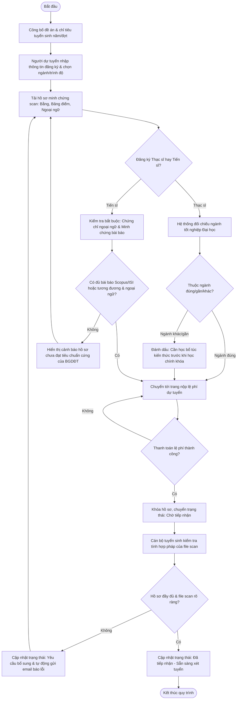
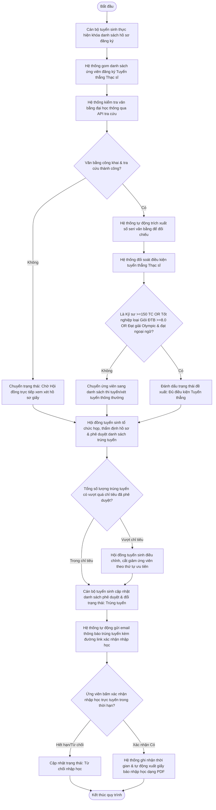
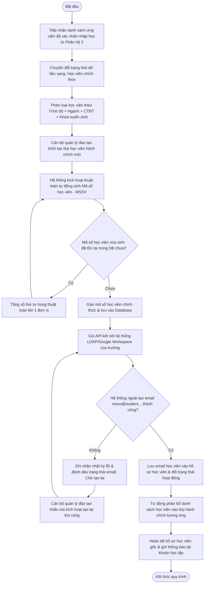
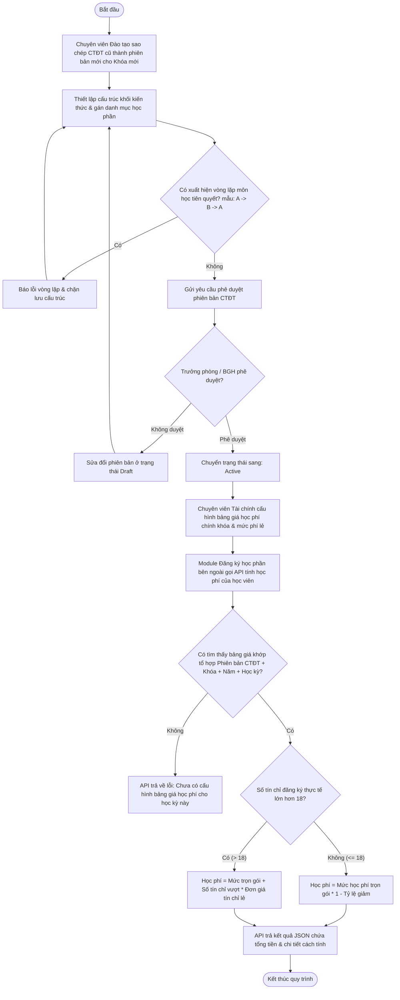
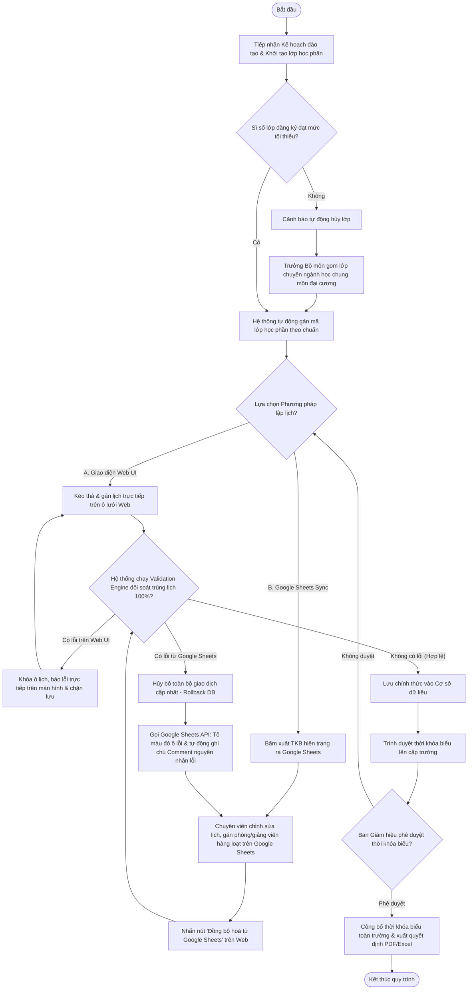

# TÀI LIỆU THIẾT KẾ MÔ TẢ CHI TIẾT HỆ THỐNG PHẦN MỀM QUẢN LÝ ĐÀO TẠO SAU ĐẠI HỌC (HỢP NHẤT 6 PHÂN HỆ)
## PHIÊN BẢN CHUYÊN SÂU V2 - TÍCH HỢP ĐỒNG BỘ GOOGLE SHEETS & KIỂM SOÁT RÀNG BUỘC CỨNG THEO QUY CHẾ BGDĐT

---

### CHƯƠNG I: MỞ ĐẦU (INTRODUCTION)

#### 1.1. Bối cảnh dự án
Đào tạo trình độ Sau đại học (bao gồm Thạc sĩ và Tiến sĩ) đóng vai trò then chốt trong việc cung cấp nguồn nhân lực chất lượng cao, các nhà nghiên cứu và chuyên gia chuyên sâu phục vụ phát triển kinh tế - xã hội. Quy trình đào tạo ở bậc học này mang tính đặc thù cao, chịu sự điều chỉnh nghiêm ngặt của các văn bản quy phạm pháp luật cấp Bộ, bao gồm:
*   **Thông tư 23/2021/TT-BGDĐT** về Quy chế tuyển sinh và đào tạo trình độ Thạc sĩ.
*   **Thông tư 18/2021/TT-BGDĐT** về Quy chế tuyển sinh và đào tạo trình độ Tiến sĩ.
*   **Quyết định số 838/QĐ-ĐHQG** và các quyết định sửa đổi bổ sung của Đại học Quốc gia về công tác tuyển sinh, đào tạo Sau đại học.

Các văn bản pháp lý này đặt ra những quy định khắt khe về học thuật, thời gian đào tạo, yêu cầu về năng lực ngoại ngữ, tiêu chuẩn công bố khoa học quốc tế (Scopus/ISI) và cơ chế đối soát kiểm soát trùng chéo, xung đột lợi ích trong quản lý chuyên môn. Do đó, việc vận hành quản lý đào tạo sau đại học bằng các phương pháp thủ công, bảng tính rời rạc hay các phần mềm đại học đại trà đang bộc lộ nhiều hạn chế nghiêm trọng.

#### 1.2. Mục tiêu của tài liệu
Tài liệu **Thiết kế mô tả hệ thống (System Description)** này được biên soạn nhằm cung cấp một bản đặc tả kỹ thuật chi tiết, thống nhất và dễ hiểu nhất về hệ thống phần mềm quản lý đào tạo sau đại học tích hợp. Tài liệu giải quyết các mục tiêu cốt lõi:
1.  **Vạch rõ ranh giới chức năng (System Boundaries):** Giúp người đọc xác định được phạm vi thực tế hệ thống sẽ giải quyết và các tính năng nằm ngoài phạm vi được bàn giao cho hệ thống khác.
2.  **Chuẩn hóa quy trình nghiệp vụ:** Số hóa và cụ thể hóa từng bước xử lý của 6 phân hệ lớn theo quy trình liên tục trong vòng đời học thuật của học viên.
3.  **Hỗ trợ Lập trình viên và QA:** Cung cấp tài liệu nghiệp vụ rõ ràng, mô hình hóa quy trình bằng sơ đồ hoạt động (Mermaid.js Activity Diagram) và các câu chuyện người dùng (User Stories) kèm theo tiêu chí nghiệm thu (Acceptance Criteria) định dạng cụ thể để sẵn sàng lập trình và viết kịch bản kiểm thử.
4.  **Dễ tiếp cận với mọi đối tượng độc giả:** Người dùng nghiệp vụ (Phòng Đào tạo, Giảng viên) và các nhà quản lý (Ban Giám hiệu) có thể dễ dàng hiểu được luồng vận hành của hệ thống mà không cần hiểu sâu về mã nguồn lập trình.

#### 1.3. Đối tượng sử dụng tài liệu
*   **Ban Giám hiệu & Hội đồng Trường:** Xem xét tính đúng đắn về mặt chính sách và khả năng đáp ứng quy chế của phần mềm.
*   **Phòng Sau đại học (Phòng Đào tạo):** Hiểu rõ cách thức hệ thống hỗ trợ nghiệp vụ lập lịch, đối soát và xét duyệt hàng ngày.
*   **Nhóm Phát triển Phần mềm (Developers):** Sử dụng các đặc tả nghiệp vụ, quy tắc ràng buộc để xây dựng cơ sở dữ liệu và viết logic xử lý.
*   **Nhóm Đảm bảo Chất lượng (QA/Tester):** Dựa vào danh sách User Stories và Acceptance Criteria để thiết kế bộ Test Cases kiểm thử hệ thống.
*   **Người ngoài ngành/Đối tác liên kết:** Có cái nhìn tổng quan, mạch lạc về hệ thống quản lý sau đại học từ đầu vào đến đầu ra.

---

### CHƯƠNG II: ĐẶT VẤN ĐỀ (PROBLEM STATEMENT)

#### 2.1. Thách thức trong quản lý đào tạo sau đại học hiện nay
Quy trình quản lý sau đại học thực tế đang đối mặt với những "nút thắt cổ chai" lớn về mặt nghiệp vụ do tính chất phức tạp của bậc đào tạo này:
1.  **Kiểm soát điều kiện và thành phần hồ sơ ứng viên phức tạp:** Hệ Thạc sĩ yêu cầu phân loại ngành đúng/ngành gần/ngành khác, xác định các môn học bổ sung kiến thức. Hệ Tiến sĩ yêu cầu rà soát ngặt nghèo chứng chỉ ngoại ngữ quốc tế còn hiệu lực và danh mục các bài báo khoa học đã công bố. Việc rà soát thủ công dễ dẫn đến sai sót, bỏ lọt hồ sơ không đủ điều kiện.
2.  **Đối soát thủ công điều kiện học vị và hạn ngạch (quota) của giảng viên:** Giảng viên đứng lớp, hướng dẫn khoa học luận văn/luận án phải thỏa mãn các tiêu chuẩn nghiêm ngặt về học vị (tối thiểu Tiến sĩ đối với Thạc sĩ, GS/PGS hoặc Tiến sĩ có công bố quốc tế đối với Tiến sĩ). Mỗi giảng viên lại có hạn ngạch hướng dẫn đồng thời tối đa (không quá 5 học viên Thạc sĩ, không quá 3-5 nghiên cứu sinh Tiến sĩ). Khi quy mô đào tạo tăng lên, việc theo dõi hạn ngạch này bằng Excel trở nên bất khả thi và dễ xảy ra hiện tượng vượt quota.
3.  **Ngăn ngừa xung đột lợi ích trong Hội đồng chuyên môn:** Quy chế đào tạo quy định tuyệt đối cấm giảng viên hướng dẫn (chính hoặc phụ) tham gia với vai trò Chủ tịch hoặc Phản biện chính trong hội đồng bảo vệ của chính học viên đó. Nếu việc phân công nhân sự hội đồng bị nhầm lẫn, quyết định thành lập hội đồng sẽ bị vô hiệu hóa, ảnh hưởng nghiêm trọng đến uy tín học thuật của nhà trường.
4.  **Theo dõi tiến độ học tập đặc thù của Nghiên cứu sinh (Mẫu BM07):** Nghiên cứu sinh Tiến sĩ tự chủ về thời gian nghiên cứu nhưng phải đảm bảo hoàn thành các mốc học thuật lớn (bảo vệ chuyên đề, nộp bài báo khoa học, bảo vệ cấp cơ sở, bảo vệ cấp trường) trong khung thời gian đào tạo tối đa (72 tháng). Việc không có công cụ bóc tách kế hoạch dự kiến và đối chiếu tiến độ thực tế để cảnh báo sớm/trễ dẫn đến tỷ lệ nghiên cứu sinh bị quá hạn đào tạo tăng cao.
5.  **Xét duyệt tốt nghiệp đa điều kiện (Rule Engine):** Việc quyết định một học viên đủ điều kiện tốt nghiệp đòi hỏi đối soát đồng thời 4 trụ cột dữ liệu: Hoàn thành khối học thuật (GPA đạt chuẩn, đủ tín chỉ); Có chứng chỉ ngoại ngữ đầu ra hợp lệ; Hoàn thành nghĩa vụ tài chính (không nợ học phí); Đã bảo vệ thành công luận văn/luận án. Việc đối chiếu thủ công qua nhiều phòng ban (Phòng Đào tạo, Phòng Tài chính, Viện đào tạo) làm kéo dài thời gian cấp bằng và gây phiền hà cho học viên.

#### 2.2. Giải pháp tích hợp Google Sheets linh hoạt cho Phòng Đào tạo
Trong nghiệp vụ lập thời khóa biểu và phân lớp, Phòng Đào tạo thường ưu tiên sử dụng Excel hoặc Google Sheets vì khả năng trực quan hóa dạng lưới (grid), cho phép thao tác chỉnh sửa hàng loạt cực nhanh bằng kéo thả và sao chép. Tuy nhiên, bảng tính rời rạc lại thiếu kết nối cơ sở dữ liệu và không thể đối soát trùng lịch phòng học hay trùng lịch giảng viên một cách tự động.

Hệ thống đề xuất **Giải pháp Đồng bộ Google Sheets hai chiều (Bidirectional Sync Engine)**:
*   Hệ thống kết xuất (Export) dữ liệu thời khóa biểu thô ra Google Sheets được liên kết.
*   Chuyên viên thoải mái lập lịch, kéo thả hàng loạt trên Google Sheets với danh mục chọn lọc (dropdown) giảng viên/phòng học được đồng bộ từ Database.
*   Khi nhấn "Đồng bộ", hệ thống nạp dữ liệu về bộ nhớ tạm, chạy **Validation Engine** để đối soát 100% ràng buộc trùng lịch. Nếu phát hiện lỗi (ví dụ: Giảng viên A trùng lịch dạy lớp khác tại cùng một kíp), hệ thống sẽ **Rollback toàn bộ giao dịch** (không lưu dữ liệu lỗi vào DB), đồng thời gọi API để tự động tô màu đỏ ô lỗi và ghi chú chi tiết nguyên nhân lỗi ngay trên trang tính Google Sheets của chuyên viên để họ sửa đổi.

#### 2.3. Sơ đồ tổng quan vòng đời học thuật (Academic Lifecycle Map)
Dưới đây là sơ đồ dòng chảy dữ liệu xuyên suốt 6 phân hệ, thể hiện cách các phân hệ liên kết chặt chẽ để tạo thành vòng đời quản lý đào tạo sau đại học khép kín:

```mermaid
flowchart LR
    M1[Phân hệ 1: Nộp hồ sơ trước tuyển sinh] -- Chuyển hồ sơ hợp lệ --> M2[Phân hệ 2: Xét tuyển & TB nhập học]
    M2 -- Chuyển danh sách xác nhận nhập học --> M3[Phân hệ 3: Phân loại học viên & Cấp MSSV/Email]
    
    subgraph Core_Process [Chuỗi vận hành học thuật khép kín]
        direction TB
        M4[Phân hệ 4: Chương trình đào tạo & Học phí]
        M5[Phân hệ 5: Phân công giảng dạy & Lập TKB]
        M6[Phân hệ 6: Điểm số, Tiến độ BM07 & Xét tốt nghiệp]
        
        M4 -- Cung cấp CTĐT & Biểu phí --> M5
        M4 -- Kiểm tra nợ học phí --> M6
        M5 -- Cung cấp TKB & Hội đồng --> M6
    end
    
    M3 -- Học viên chính thức --> M4
    M3 -- Roster đủ điều kiện --> M5
    M3 -- Hồ sơ gốc xét TN --> M6
    
    style M1 fill:#333,stroke:#f0f,stroke-width:2px,color:#fff
    style M2 fill:#333,stroke:#bbf,stroke-width:2px,color:#fff
    style M3 fill:#333,stroke:#dfd,stroke-width:2px,color:#fff
    style M4 fill:#333,stroke:#fdd,stroke-width:2px,color:#fff
    style M5 fill:#333,stroke:#ff9,stroke-width:2px,color:#fff
    style M6 fill:#333,stroke:#f96,stroke-width:2px,color:#fff
```

---

### CHƯƠNG III: CHI TIẾT THIẾT KẾ 6 PHÂN HỆ NGHIỆP VỤ CỐT LÕI

#### PHÂN HỆ 1: NỘP HỒ SƠ TRƯỚC TUYỂN SINH

##### 1. Giới thiệu chung (Introduction)
Phân hệ **Nộp hồ sơ trước tuyển sinh** chịu trách nhiệm số hóa toàn bộ giai đoạn tiếp cận ban đầu của ứng viên dự tuyển trình độ Thạc sĩ và Tiến sĩ [5]. Phân hệ giải quyết bài toán tiếp nhận hồ sơ trực tuyến, thu lệ phí đăng ký, phân loại hồ sơ đăng ký theo năm học/đợt tuyển sinh và tự động hóa việc đối soát, kiểm tra sơ bộ tính đầy đủ của thành phần hồ sơ cũng như điều kiện dự tuyển cơ bản của ứng viên trước khi chuyển giao thông tin sang phân hệ Xét tuyển [5, 6].

##### 2. Các tác nhân hệ thống (System Actors) [5]
*   **Primary Actors (Tác nhân trực tiếp):**
    *   **Người Dự Tuyển:** Tìm hiểu thông tin tuyển sinh, tự đối chiếu điều kiện cá nhân, thực hiện khai báo thông tin đăng ký trực tuyến, tải lên các file scan tài liệu/minh chứng, nộp lệ phí dự tuyển và theo dõi trạng thái hồ sơ [5, 6].
    *   **Đơn vị Phụ trách Tuyển sinh (Cán bộ tiếp nhận):** Thực hiện duyệt kiểm tra tính hợp lệ về mặt hành chính của các tài liệu hồ sơ tải lên, đánh dấu hồ sơ đạt/chưa đạt yêu cầu bổ sung kiến thức [5, 6].
    *   **Ban Thư ký Hội đồng Tuyển sinh:** Quản lý thông tin lệ phí, xác nhận trạng thái đóng lệ phí dự tuyển của thí sinh [5].
*   **Secondary Actors/Systems:**
    *   **Hệ thống Thanh toán trực tuyến (Payment Gateway):** Tiếp nhận yêu cầu thanh toán lệ phí tuyển sinh, xử lý giao dịch và phản hồi kết quả giao dịch về hệ thống.

##### 3. Phạm vi hệ thống (System Scope) [5]
*   **In-scope (Bắt buộc phát triển):**
    *   Khai báo và công bố thông tin đề án tuyển sinh theo từng năm, từng đợt [5, 6].
    *   Form đăng ký trực tuyến cho ứng viên lựa chọn Trình độ (Thạc sĩ/Tiến sĩ), Ngành/Chương trình, Phương thức tuyển sinh [6].
    *   Module tải lên và quản lý danh mục tài liệu hồ sơ số hóa dựa theo cấu hình thành phần hồ sơ của từng năm và trình độ [6].
    *   Tính năng tự động kiểm tra điều kiện thâm niên công tác, ngành tốt nghiệp đại học (đúng/gần/khác) đối với Thạc sĩ và điều kiện văn bằng, ngoại ngữ đối với Tiến sĩ [6].
    *   Tích hợp thanh toán lệ phí dự tuyển trực tuyến và ghi nhận trạng thái đóng phí [6].
    *   Màn hình kiểm tra hồ sơ dành cho Cán bộ tuyển sinh, cho phép cập nhật trạng thái hồ sơ (Chờ duyệt, Yêu cầu bổ sung, Đã tiếp nhận) [6].
*   **Out-of-scope (Không phát triển):**
    *   Tự động phê duyệt kết quả trúng tuyển cuối cùng (nghiệp vụ này thuộc Phân hệ 2 dưới sự điều hành của Hội đồng Tuyển sinh) [7].
    *   Chấm thi tuyển sinh hoặc lưu trữ điểm thi tuyển sinh [7].

##### 4. Danh mục Use Case chi tiết [6]
*   `UC-01: Tra cứu thông tin tuyển sinh` (Actor: Người Dự Tuyển) [6]
*   `UC-02: Xác định điều kiện dự tuyển` (Actor: Người Dự Tuyển) [6]
*   `UC-03: Đăng ký dự tuyển trực tuyến` (Actor: Người Dự Tuyển) [6]
*   `UC-04: Chuẩn bị và nộp hồ sơ minh chứng` (Actor: Người Dự Tuyển) [6]
*   `UC-05: Nộp lệ phí đăng ký dự tuyển` (Actor: Người Dự Tuyển) [6]
*   `UC-06: Tiếp nhận và kiểm tra hồ sơ` (Actor: Đơn vị Phụ trách Tuyển sinh) [6]
*   `UC-07: Xử lý kết quả hồ sơ hành chính` (Actor: Đơn vị Phụ trách Tuyển sinh) [6]

##### 5. Quy trình nghiệp vụ: Đăng ký & Kiểm tra điều kiện dự tuyển sơ bộ
Quy trình này mô tả việc ứng viên nộp hồ sơ, hệ thống tự động kiểm soát điều kiện ban đầu và cán bộ tuyển sinh phê duyệt hành chính.

##### 6. User Story & Tiêu chí nghiệm thu (Acceptance Criteria) [6]
*   **User Story:** As a **Người Dự Tuyển**, I want to **nộp hồ sơ và lệ phí trực tuyến trên hệ thống**, so that **tôi có thể hoàn tất thủ tục đăng ký sau đại học nhanh chóng mà không cần đến nộp trực tiếp tại trường** [5, 6].
    *   **Acceptance Criteria 1.1:** Khi ứng viên chọn Trình độ đào tạo là "Tiến sĩ", hệ thống bắt buộc phải hiển thị hai trường tải lên tài liệu minh chứng bắt buộc: "Chứng chỉ ngoại ngữ đầu vào" và "Danh mục công bố bài báo khoa học" [6]. Hệ thống sẽ chặn không cho nhấn nút gửi hồ sơ nếu hai tài liệu này trống [6].
    *   **Acceptance Criteria 1.2:** Khi ứng viên nộp tiền lệ phí thành công qua Cổng thanh toán, hệ thống phải tự động cập nhật trường trạng thái `is_paid_fee = TRUE` trong vòng tối đa 3 giây, đồng thời gửi email biên lai thu lệ phí tự động cho ứng viên.

##### 7. Đầu vào / Đầu ra [7]
*   **Đầu vào:** Thông tin tuyển sinh theo năm/đợt; Thông tin cá nhân người dự tuyển; Minh chứng văn bằng, bảng điểm, ngoại ngữ, danh mục bài báo [7].
*   **Đầu ra:** Dữ liệu hồ sơ số hóa của ứng viên kèm theo trạng thái "Đã tiếp nhận" và "Đã đóng lệ phí" để làm đầu vào cho Phân hệ 2 [7].

---
#### PHÂN HỆ 2: XẾP TUYỂN VÀ THÔNG BÁO NHẬP HỌC

##### 1. Giới thiệu chung (Introduction) [7]
Phân hệ **Xét tuyển và thông báo nhập học** thực hiện tự động hóa chuỗi nghiệp vụ từ khi khóa danh sách tiếp nhận hồ sơ, chuyển giao hồ sơ cho Hội đồng tuyển sinh thẩm định, đối soát chỉ tiêu, cập nhật kết quả trúng tuyển đã phê duyệt, cho đến khi gửi thông báo kết quả và tiếp nhận xác nhận nhập học trực tuyến của ứng viên [7, 8].

##### 2. Các tác nhân hệ thống (System Actors) [8]
*   **Primary Actors (Tác nhân trực tiếp):**
    *   **Hội đồng tuyển sinh:** Kiểm tra, xem xét điều kiện hồ sơ ứng viên; thực hiện xét duyệt tuyển thẳng, xét trúng tuyển dựa trên chỉ tiêu và phê duyệt kết quả cuối cùng [8].
    *   **Cán bộ tuyển sinh / Chuyên viên SĐH:** Quản lý và khóa danh sách hồ sơ, cập nhật kết quả tuyển sinh đã được Hội đồng phê duyệt lên hệ thống, phát hành giấy báo nhập học [8].
    *   **Ứng viên:** Tra cứu kết quả tuyển sinh cá nhân, thực hiện thao tác xác nhận nhập học trực tuyến [8].
*   **Secondary Actors/Systems:**
    *   **Hệ thống xác thực văn bằng công khai:** Hệ thống bên ngoài hỗ trợ tra cứu và tự động trích xuất số seri đối với các văn bằng đại học/thạc sĩ công khai [7, 8].

##### 3. Phạm vi hệ thống (System Scope) [7, 8]
*   **In-scope (Bắt buộc phát triển):**
    *   Chức năng khóa cứng danh sách hồ sơ tuyển sinh ngay khi hết hạn nộp để đảm bảo tính minh bạch dữ liệu [7].
    *   Tích hợp công cụ API tra cứu văn bằng công khai, hỗ trợ trích xuất số seri tự động cho Hội đồng đối soát [7].
    *   Bộ lọc kiểm tra tự động các tiêu chí xét tuyển thẳng Thạc sĩ (Kỹ sư $\ge 150$ tín chỉ, bằng đại học chính quy loại Giỏi ĐTB $\ge 8.0$, đạt giải Olympic sinh viên) và hiển thị cảnh báo nếu không đủ điều kiện ngoại ngữ đi kèm [7].
    *   Quản lý chỉ tiêu tuyển sinh theo năm, ngành, chương trình đào tạo; hỗ trợ đối chiếu số lượng ứng viên đề xuất với chỉ tiêu thực tế [8].
    *   Tính năng xác nhận nhập học trực tuyến của ứng viên trúng tuyển, ghi nhận mốc thời gian thực hiện [8].
    *   Tự động sinh và gửi giấy báo nhập học trực tuyến (PDF) cho ứng viên đã xác nhận nhập học thành công [9].
*   **Out-of-scope (Không phát triển):**
    *   Hệ thống không tự động quyết định ứng viên đỗ hay trượt; kết quả hoàn toàn dựa trên sự phê duyệt của Hội đồng và được cán bộ cập nhật thủ công vào hệ thống [7].

##### 4. Danh mục Use Case chi tiết [9]
*   `UC-01: Khóa danh sách hồ sơ tuyển sinh` (Actor: Cán bộ tuyển sinh) [9]
*   `UC-02: Tra cứu và kiểm tra văn bằng` (Actor: Hội đồng tuyển sinh / Cán bộ tuyển sinh) [9]
*   `UC-03: Xem xét tuyển thẳng Thạc sĩ` (Actor: Hội đồng tuyển sinh) [9]
*   `UC-04: Xem xét xét tuyển Thạc sĩ` (Actor: Hội đồng tuyển sinh) [9]
*   `UC-05: Xem xét tuyển sinh Tiến sĩ` (Actor: Hội đồng tuyển sinh) [9]
*   `UC-06: Quản lý và xét chỉ tiêu tuyển sinh` (Actor: Hội đồng tuyển sinh) [9]
*   `UC-07: Phê duyệt kết quả tuyển sinh` (Actor: Hội đồng tuyển sinh) [9]
*   `UC-08: Thông báo kết quả tuyển sinh` (Actor: Cán bộ tuyển sinh / Hệ thống) [9]
*   `UC-09: Xác nhận nhập học trực tuyến` (Actor: Ứng viên) [9]
*   `UC-10: Phát hành giấy báo nhập học` (Actor: Cán bộ tuyển sinh) [9]

##### 5. Quy trình nghiệp vụ: Xét tuyển thẳng Thạc sĩ & Xác nhận nhập học
Quy trình này mô tả luồng thẩm định tuyển thẳng cho bậc Thạc sĩ, cập nhật phê duyệt của Hội đồng, và quy trình xác nhận nhập học trực tuyến của ứng viên trúng tuyển.

##### 6. User Story & Tiêu chí nghiệm thu (Acceptance Criteria) [10]
*   **User Story:** As a **Hội đồng tuyển sinh**, I want to **sử dụng bộ lọc kiểm tra tự động điều kiện tuyển thẳng Thạc sĩ**, so that **giảm bớt thời gian rà soát hồ sơ thủ công bằng giấy và hạn chế tối đa các sai sót về điều kiện ngoại ngữ đi kèm** [7, 8].
    *   **Acceptance Criteria 2.1:** Khi chạy chức năng lọc danh sách tuyển thẳng hệ Thạc sĩ, hệ thống phải tự động đánh dấu "Đề xuất tuyển thẳng" cho các hồ sơ có trường học vị tốt nghiệp đại học đạt loại "Giỏi" (GPA $\ge 8.0$) HOẶC hệ đào tạo là "Kỹ sư" với tổng số tín chỉ tích lũy $\ge 150$, đồng thời trường ngoại ngữ phải có chứng chỉ còn thời hạn hợp lệ [7, 8].
    *   **Acceptance Criteria 2.2:** Hệ thống tuyệt đối chặn không cho phép cán bộ tuyển sinh chuyển một hồ sơ sang trạng thái "Trúng tuyển" trên cơ sở dữ liệu nếu hồ sơ đó chưa có biên bản phê duyệt được số hóa đính kèm chữ ký điện tử của Chủ tịch Hội đồng tuyển sinh [10].

##### 7. Đầu vào / Đầu ra [10]
*   **Đầu vào:** Hồ sơ ứng viên và các minh chứng từ Phân hệ 1; Chỉ tiêu tuyển sinh theo ngành/CTĐT [10].
*   **Đầu ra:** Danh sách ứng viên trúng tuyển chính thức; Giấy báo nhập học điện tử (PDF); Danh sách học viên đã xác nhận nhập học trực tuyến làm dữ liệu đầu vào cho Phân hệ 3 [10].

---
#### PHÂN HỆ 3: PHÂN LOẠI HỌC VIÊN (LỚP / NGÀNH / MÃ SỐ)

##### 1. Giới thiệu chung (Introduction) [10]
Phân hệ **Phân loại học viên** đóng vai trò cầu nối chuyển đổi toàn diện dữ liệu từ giai đoạn "Ứng viên trúng tuyển" sang "Học viên chính thức" sau khi hoàn tất thủ tục nhập học trực tuyến [10]. Nhiệm vụ trọng tâm của phân hệ là thực hiện phân loại cấu trúc học viên theo bậc học, ngành học, chương trình đào tạo, tổ chức phân lớp hành chính, tự động hóa việc sinh mã số học viên duy nhất và cấp phát tài khoản email nội bộ của trường [10].

##### 2. Các tác nhân hệ thống (System Actors) [8, 11]
*   **Primary Actors (Tác nhân trực tiếp):**
    *   **Cán bộ quản lý đào tạo:** Thực hiện thiết lập cấu trúc tổ chức lớp học, chạy tính năng phân lớp tự động, kiểm tra và cấp phát mã số học viên, kích hoạt email học viên hàng loạt [11].
*   **Secondary Actors/Systems:**
    *   **Hệ thống Quản lý tài khoản trường (LDAP / Google Workspace Admin API):** Hệ thống ngoài tiếp nhận yêu cầu từ phân hệ này để tạo tự động tài khoản email học viên định dạng chuẩn của trường.

##### 3. Phạm vi hệ thống (System Scope) [10, 11]
*   **In-scope (Bắt buộc phát triển):**
    *   Chuyển đổi dữ liệu tự động từ bảng Ứng viên trúng tuyển đã xác nhận nhập học sang bảng Hồ sơ học viên chính thức, bảo toàn lịch sử từ giai đoạn trước tuyển sinh [10].
    *   Phân loại học viên đa chiều: Theo trình độ đào tạo (Thạc sĩ, Tiến sĩ), Ngành học, Chương trình đào tạo (Định hướng nghiên cứu hoặc Ứng dụng), và Khóa tuyển sinh [10].
    *   Thiết lập và khởi tạo lớp học viên hành chính (Ví dụ: Lớp Cao học CNTT K2026) [10].
    *   Cơ chế sinh Mã số học viên (MSSV) tự động theo thuật toán cấu trúc: `[Bậc học: 1 ký tự] + [Năm học: 2 ký tự] + [Mã ngành: 3 ký tự] + [Số thứ tự tăng dần: 4 ký tự]`. Hệ thống bắt buộc phải kiểm tra chống trùng lặp MSSV 100% trước khi lưu [12].
    *   API kết nối đồng bộ cấp phát email học viên tự động (định dạng `mssv@student.university.edu.vn`) [10, 12].
*   **Out-of-scope (Không phát triển):**
    *   Quản lý việc thay đổi ngành học hoặc chương trình đào tạo của học viên (mọi sự thay đổi này nếu có phải thực hiện thủ công bằng quyết định hành chính ngoài hệ thống và cập nhật lại) [12].

##### 4. Danh mục Use Case chi tiết [11]
*   `UC-11: Phân loại học viên tự động` (Actor: Cán bộ quản lý đào tạo) [11]
*   `UC-12: Tạo và phân lớp học viên` (Actor: Cán bộ quản lý đào tạo) [11]
*   `UC-13: Cấp mã số học viên` (Actor: Cán bộ quản lý đào tạo) [11]
*   `UC-14: Cấp và cập nhật email học viên` (Actor: Cán bộ quản lý đào tạo) [11]
*   `UC-15: Chuyển đổi hồ sơ ứng viên thành hồ sơ học viên` (Actor: Cán bộ quản lý đào tạo) [11]

##### 5. Quy trình nghiệp vụ: Tiếp nhận học viên & Cấp mã số, Email tự động
Quy trình mô tả luồng biến đổi từ hồ sơ ứng viên thành học viên chính thức, phân lớp hành chính và kích hoạt tài khoản số học tập.

##### 6. User Story & Tiêu chí nghiệm thu (Acceptance Criteria) [12]
*   **User Story:** As a **Cán bộ quản lý đào tạo**, I want to **chuyển đổi danh sách ứng viên trúng tuyển thành học viên chính thức và tự động sinh mã số, email hàng loạt**, so that **tôi không phải nhập liệu tay từng học viên, tránh sai sót trùng mã số học viên** [10, 11, 12].
    *   **Acceptance Criteria 3.1:** Khi thực hiện chức năng "Chuyển đổi hồ sơ ứng viên thành học viên", hệ thống phải kiểm tra và đảm bảo ngành học và chương trình đào tạo của học viên sau khi phân lớp khớp chính xác 100% với thông tin ngành trúng tuyển tại Phân hệ 2 [12]. Hệ thống sẽ chặn và hiển thị thông báo lỗi nếu có sự lệch dữ liệu ngành [12].
    *   **Acceptance Criteria 3.2:** MSSV được sinh ra phải duy nhất. Hệ thống phải thực hiện một truy vấn kiểm tra sự tồn tại (Unique Constraint) trong Database trước khi gán MSSV cho học viên. Nếu phát hiện trùng lặp, hệ thống phải tự động điều chỉnh chỉ số tăng dần trong mã mà không được dừng quy trình chạy hàng loạt.

##### 7. Đầu vào / Đầu ra [12]
*   **Đầu vào:** Danh sách ứng viên đã xác nhận nhập học từ Phân hệ 2; Danh mục ngành, CTĐT từ Phân hệ 4 [12].
*   **Đầu ra:** Hồ sơ học viên chính thức đã được gán mã số học viên, email học viên và phân bổ vào lớp hành chính làm dữ liệu gốc cho các phân hệ 4, 5, 6 [12].

---
#### PHÂN HỆ 4: CHƯƠNG TRÌNH ĐÀO TẠO VÀ HỌC PHÍ

##### 1. Giới thiệu chung (Introduction) [12]
Phân hệ **Chương trình đào tạo và Học phí** quản trị toàn bộ tài nguyên học thuật gốc và chính sách tài chính của bậc Sau đại học [12]. Phân hệ giải quyết bài toán quản lý phiên bản chương trình đào tạo theo khóa học, cấu trúc khối kiến thức - học phần, đồng thời thiết lập chính sách giá học phí linh hoạt và cung cấp API tính toán học phí lũy tiến tự động phục vụ cho Module Đăng ký học phần [12].

##### 2. Các tác nhân hệ thống (System Actors) [12]
*   **Primary Actors (Tác nhân trực tiếp):**
    *   **Chuyên viên Đào tạo (Phòng Sau Đại học):** Tạo mới, cập nhật chương trình đào tạo (CTĐT) gốc, thiết lập phiên bản CTĐT và cấu hình danh mục học phần, gán học phần tiên quyết [12].
    *   **Người phê duyệt (Trưởng phòng / BGH):** Xem xét, phê duyệt hoặc từ chối phiên bản CTĐT [12].
    *   **Chuyên viên Tài chính:** Thiết lập bảng giá học phí theo tổ hợp năm/học kỳ, cấu hình các mức phí thu đặc thù (học lại, bảo vệ lại, gia hạn luận văn/luận án...) [12].
    *   **Học viên / Nghiên cứu sinh:** Tra cứu cấu trúc CTĐT cá nhân và xem bảng kê học phí cần đóng [12].
*   **Secondary Actors/Systems:**
    *   **Module Đăng ký học phần (Hệ thống ngoài):** Gọi API tính học phí của phân hệ này để lấy số tiền học phí thực tế của học viên ngay khi đăng ký môn học [12].

##### 3. Phạm vi hệ thống (System Scope) [12, 13]
*   **In-scope (Bắt buộc phát triển):**
    *   Quản lý chương trình đào tạo gốc và cơ chế sao chép/tạo phiên bản CTĐT theo từng khóa tuyển sinh để bảo toàn lịch sử (CTĐT khóa cũ không bị ảnh hưởng khi khóa mới thay đổi) [12].
    *   Quản lý cấu trúc khối kiến thức (Bắt buộc, Tự chọn) và thiết lập quan hệ học phần tiên quyết/song hành (kiểm tra ngăn chặn vòng lặp tiên quyết) [12, 13].
    *   Quản lý bảng giá học phí chính khóa theo tổ hợp: `Phiên bản CTĐT + Khóa tuyển sinh + Năm học + Học kỳ` [12].
    *   Quản lý danh mục và mức thu các khoản phí đặc thù: Gia hạn thời gian làm luận văn/luận án, bảo vệ lại hội đồng, học bổ sung kiến thức [12].
    *   **API tính học phí tự động** cho Module Đăng ký học phần áp dụng công thức lũy tiến vượt định mức [13]:
        *   Nếu số tín chỉ đăng ký $\le 18$ tín chỉ: Học phí = `Mức trọn gói học kỳ * (1 - Tỷ lệ giảm)`.
        *   Nếu số tín chỉ đăng ký $> 18$ tín chỉ: Học phí = `Mức trọn gói học kỳ + (Số tín chỉ vượt * Đơn giá học phí một tín chỉ lẻ)`.
*   **Out-of-scope (Không phát triển):**
    *   Hệ thống không tích hợp cổng thanh toán học phí trực tiếp của ngân hàng hay theo dõi số dư ví tài chính của học viên (chỉ xuất hóa đơn tính toán số tiền học viên phải đóng) [12].

##### 4. Danh mục Use Case chi tiết [14]
*   `UC-CTDT-01: Tạo chương trình đào tạo gốc` (Actor: Chuyên viên Đào tạo) [14]
*   `UC-CTDT-02: Tạo phiên bản CTĐT mới` (Actor: Chuyên viên Đào tạo) [14]
*   `UC-CTDT-03: Quản lý học phần trong phiên bản CTĐT` (Actor: Chuyên viên Đào tạo) [14]
*   `UC-CTDT-04: Thiết lập cấu trúc khối kiến thức` (Actor: Chuyên viên Đào tạo) [14]
*   `UC-CTDT-05: Phê duyệt phiên bản CTĐT` (Actor: Người phê duyệt) [14]
*   `UC-HP-01: Thiết lập học phí cho một học kỳ` (Actor: Chuyên viên Tài chính) [14]
*   `UC-HP-02: Thiết lập mức phí đặc thù` (Actor: Chuyên viên Tài chính) [14]
*   `UC-HP-03: Tính học phí cho học viên (API)` (Actor: Module Đăng ký học phần) [14]
*   `UC-HP-04: Tra cứu học phí của học viên` (Actor: Học viên / Nghiên cứu sinh) [14]

##### 5. Quy trình nghiệp vụ: Quản lý phiên bản CTĐT & Tính học phí API
Quy trình mô tả luồng kiểm duyệt phiên bản chương trình đào tạo bảo toàn lịch sử và cơ chế xử lý API tính học phí vượt định mức.

##### 6. User Story & Tiêu chí nghiệm thu (Acceptance Criteria) [14]
*   **User Story:** As a **Chuyên viên Tài chính**, I want to **cấu hình bảng giá học phí cho từng khóa học và học kỳ riêng biệt**, so that **khi học viên đăng ký vượt số tín chỉ quy định, hệ thống sẽ tự động tính đúng học phí lũy tiến mà không cần tính toán thủ công bằng Excel** [12, 13].
    *   **Acceptance Criteria 4.1:** Nếu một phiên bản CTĐT đã ở trạng thái "Active" và đã có ít nhất một học viên đăng ký học tập, hệ thống phải khóa cứng toàn bộ cấu trúc khối kiến thức và danh mục học phần bắt buộc của phiên bản đó. Chuyên viên muốn sửa đổi bắt buộc phải tạo một phiên bản mới [14].
    *   **Acceptance Criteria 4.2:** Khi gọi API tính học phí với đầu vào là 20 tín chỉ đăng ký, hệ thống phải tra cứu đúng bảng giá áp dụng cho học kỳ hiện tại, lấy ra mức trọn gói (ví dụ: 15,000,000đ) cộng với 2 tín chỉ vượt trội nhân đơn giá một tín chỉ lẻ (ví dụ: 800,000đ/tín chỉ), kết quả trả ra phải bằng đúng 16,600,000đ [13].

##### 7. Đầu vào / Đầu ra [15]
*   **Đầu vào:** Danh mục môn học; Thông tin khóa tuyển sinh của học viên; Số tín chỉ học viên đăng ký thực tế từ hệ thống ngoài [15].
*   **Đầu ra:** Cấu trúc CTĐT chính thức; Bảng kê học phí chi tiết (JSON) cung cấp trực tiếp cho Module Đăng ký học phần [15].

---
#### PHÂN HỆ 5: PHÂN CÔNG GIẢNG DẠY, XẾP LỚP, THỜI KHÓA BIỂU

##### 1. Giới thiệu chung (Introduction) [15]
Phân hệ **Phân công giảng dạy, xếp lớp, thời khóa biểu** chịu trách nhiệm điều phối toàn bộ tài nguyên học thuật của bậc đào tạo Sau đại học [15]. Phân hệ giải quyết bài toán phân công đứng lớp học phần, phân công giảng viên hướng dẫn khoa học luận văn/luận án, thành lập hội đồng chuyên môn các cấp, xếp lịch học dồn đặc thù và đặc biệt tích hợp **Cơ chế đồng bộ Google Sheets hai chiều linh hoạt** phục vụ cho người lập lịch [15, 16].

##### 2. Các tác nhân hệ thống (System Actors) [15]
*   **Primary Actors (Tác nhân trực tiếp):**
    *   **Trưởng Khoa / Trưởng Bộ môn:** Người trực tiếp tạo/gom lớp học phần, đề xuất danh sách giảng viên đứng lớp, đề xuất giảng viên hướng dẫn khoa học và đề cử thành viên hội đồng chuyên môn [15].
    *   **Chuyên viên Phòng Đào tạo (Phòng Sau Đại học):** Người quản trị, thiết lập tiêu chuẩn và quota giảng dạy, thẩm định hồ sơ phân công, lập thời khóa biểu toàn trường, thực hiện đồng bộ hai chiều dữ liệu lịch với Google Sheets và xuất bản lịch biểu chính thức [15].
    *   **Giảng viên:** Tra cứu lịch dạy, cập nhật khung giờ bận/rảnh cá nhân [15].
    *   **Học viên / Nghiên cứu sinh:** Tra cứu thời khóa biểu cá nhân, nhận lịch bảo vệ hội đồng [15].
    *   **Google Sheets API Service:** Dịch vụ kết nối ngoài hỗ trợ đọc/ghi dữ liệu thời gian thực giữa bảng tính và Database hệ thống.

##### 3. Phạm vi hệ thống (System Scope) [15, 16]
*   **In-scope (Bắt buộc phát triển):**
    *   Chức năng gom lớp học phần chuyên ngành học chung các môn đại cương và tự động gán mã lớp học phần theo chuẩn [16].
    *   Bộ lọc tự động đối soát điều kiện học vị giảng viên đứng lớp (Thạc sĩ: Tiến sĩ trở lên; Tiến sĩ: Giáo sư, Phó Giáo sư hoặc Tiến sĩ có bài báo Scopus/ISI trong hạn định) [17].
    *   Kiểm soát hạn ngạch (quota) hướng dẫn đồng thời của giảng viên (Thạc sĩ $\le 5$ học viên; Tiến sĩ $\le 3-5$ nghiên cứu sinh tùy thuộc học hàm) [17].
    *   **Quy tắc đối soát Hội đồng chuyên môn cứng:** Hội đồng phải đủ 5 hoặc 7 thành viên, đảm bảo tỷ lệ thành viên ngoài trường và **ngăn chặn tuyệt đối xung đột lợi ích** (giảng viên hướng dẫn không được làm Chủ tịch hoặc Phản biện chính trong hội đồng của học viên mình hướng dẫn) [17].
    *   Lập lịch học dồn đặc thù (2-3 tuần) hoặc học tối/cuối tuần [15, 16].
    *   **Đồng bộ Google Sheets hai chiều (Bidirectional Sync Engine):**
        *   Cho phép xuất thời khóa biểu hiện tại ra file Google Sheets mẫu để Chuyên viên Phòng Đào tạo chỉnh sửa hàng loạt trực quan [15].
        *   Nút bấm "Đồng bộ" gọi API nạp dữ liệu về Database tạm thời, chạy Validation Engine kiểm tra 100% trùng lịch giảng viên, trùng lịch phòng học và sức chứa giảng đường [16].
        *   Cơ chế **Giao dịch hai pha (Two-Phase Sync)**: Nếu phát hiện lỗi trùng/xung đột lịch, hệ thống lập tức **Rollback** toàn bộ giao dịch, đồng thời gọi API để tô màu đỏ các ô vi phạm và tự động chèn ghi chú lỗi (comment) trực tiếp vào ô lỗi trên Google Sheets của chuyên viên để họ sửa đổi nhanh chóng.
    *   Tự động tính tổng tải giảng dạy quy đổi của giảng viên [15].
*   **Out-of-scope (Không phát triển):**
    *   Quản lý việc mượn/đặt lịch phòng học cho các sự kiện không thuộc hoạt động đào tạo của trường [18].

##### 4. Danh mục Use Case chi tiết [17]
*   `UC-01: Khai báo và gom/tách lớp học phần` (Actor: Trưởng Bộ môn) [17]
*   `UC-02: Phân công giảng viên đứng lớp` (Actor: Trưởng Bộ môn) [17]
*   `UC-03: Phân công giảng viên hướng dẫn luận án/luận văn` (Actor: Trưởng Bộ môn) [17]
*   `UC-04: Phân công và thành lập hội đồng chuyên môn` (Actor: Phòng Sau Đại học) [17]
*   `UC-05a: Lập thời khóa biểu đặc thù trên Web UI` (Actor: Trưởng Bộ môn) [17]
*   `UC-05b: Đồng bộ lập thời khóa biểu qua Google Sheets (V2)` (Actor: Chuyên viên Phòng Đào tạo)
*   `UC-06: Phê duyệt phân công và thời khóa biểu` (Actor: Phòng Sau Đại học / Ban Giám hiệu) [17]
*   `UC-07: Xem lịch và phản hồi điều chỉnh TKB` (Actor: Giảng viên, Học viên/NCS) [17]
*   `UC-08: Báo cáo thống kê định mức tổng tải giảng viên` (Actor: Phòng Sau Đại học) [17]

##### 5. Quy trình nghiệp vụ: Lập TKB đa phương thức & Đồng bộ Google Sheets hai chiều
Quy trình mô tả sự phối hợp giữa giao diện Web UI truyền thống và Google Sheets Sync Engine, tích hợp Validation Engine chạy ngầm đối soát xung đột lịch học dồn và ghi chú lỗi trực tiếp lên Google Sheets.

##### 6. User Story & Tiêu chí nghiệm thu (Acceptance Criteria) [16]
*   **User Story:** As a **Chuyên viên Phòng Đào tạo**, I want to **sử dụng Google Sheets để lập thời khóa biểu và đồng bộ hai chiều về hệ thống**, so that **tôi có thể xếp lịch nhanh chóng cho hàng loạt lớp học phần trên giao diện lưới quen thuộc mà hệ thống vẫn tự động phát hiện và cảnh báo chính xác các ô bị trùng lịch** [15, 16].
    *   **Acceptance Criteria 5.1:** Khi thực hiện đồng bộ từ Google Sheets, nếu có dòng dữ liệu xếp giảng viên đứng lớp cho lớp học phần vượt quá định mức tải lao động quy định hoặc gán lịch học cho lớp có sĩ số vượt sức chứa phòng, hệ thống phải chạy Validation Engine, trả về trạng thái lỗi trên Web và **giữ nguyên dữ liệu cũ trong Database** [16].
    *   **Acceptance Criteria 5.2:** Hệ thống phải gọi Google Sheets API để tô màu đỏ nhạt (#FCE8E6) vào chính xác ô bị lỗi trên trang tính Google Sheets (Ví dụ: cột "Phòng học" tại dòng 12 bị trùng lịch) và tạo một Google Sheet Comment tại ô đó ghi rõ nguyên nhân: `"Lỗi: Phòng học B.201 đã bị xếp lịch bận cho Lớp Thạc sĩ QTKD vào Thứ 7 kíp 1"` [16].

##### 7. Đầu vào / Đầu ra [18]
*   **Đầu vào:** Danh mục môn học; Danh sách học viên đủ điều kiện làm luận văn; Danh mục phòng học và sức chứa thực tế [18].
*   **Đầu ra:** Quyết định phân công người hướng dẫn; Quyết định thành lập hội đồng chuyên môn; Bảng thời khóa biểu tổng thể (Excel); Báo cáo tổng tải lao động giảng viên (Excel) [18].

---
#### PHÂN HỆ 6: ĐIỂM SỐ, TIẾN ĐỘ HỌC TẬP VÀ XẾP TỐT NGHIỆP

##### 1. Giới thiệu chung (Introduction) [18]
Phân hệ **Điểm số, tiến độ học tập và xét tốt nghiệp** quản trị giai đoạn cuối cùng trong vòng đời học thuật của học viên Sau đại học [18]. Phân hệ giải quyết 3 bài toán kỹ thuật cốt lõi: tự động quy đổi thang điểm và tính GPA học phần; theo dõi, bóc tách và cảnh báo sớm/trễ tiến độ học tập theo **kế hoạch học thuật Mẫu BM07 dành riêng cho Nghiên cứu sinh Tiến sĩ**; và vận hành **Rule Engine đa điều kiện** để tự động xét duyệt tốt nghiệp [18, 19].

##### 2. Các tác nhân hệ thống (System Actors) [18]
*   **Primary Actors (Tác nhân trực tiếp):**
    *   **Giảng viên:** Nhập điểm học phần trực tiếp cho các lớp học phần được phân công, chấm điểm các chuyên đề nghiên cứu [18].
    *   **Nghiên cứu sinh (NCS):** Tải lên bản scan kế hoạch học tập toàn khóa (BM07) có chữ ký, tự khai báo các mốc học thuật dự kiến, cập nhật minh chứng ngoại ngữ [18, 19].
    *   **Người hướng dẫn khoa học:** Xem xét tiến độ nghiên cứu của học viên, phê duyệt kế hoạch học tập BM07 trực tuyến [18, 19].
    *   **Chuyên viên Phòng Sau Đại học:** Duyệt bản scan kế hoạch học tập BM07, cấu hình các quy tắc xét tốt nghiệp, chạy lệnh quét xét tốt nghiệp tự động và xuất bảng điểm, báo cáo tốt nghiệp [18, 19].
*   **Secondary Actors/Systems:**
    *   **Phân hệ Tài chính (Phân hệ 4):** Cung cấp API/truy vấn dữ liệu công nợ để kiểm tra điều kiện hoàn thành nghĩa vụ học phí của học viên [18, 21].

##### 3. Phạm vi hệ thống (System Scope) [18, 19]
*   **In-scope (Bắt buộc phát triển):**
    *   Giao diện nhập điểm học phần thang 10, tự động quy đổi sang điểm chữ (A, B, C...) và điểm hệ 4, tự động tính toán lại GPA tích lũy của học viên mỗi khi có điểm mới [19].
    *   Module quản lý kế hoạch học tập toàn khóa **Mẫu BM07 dành riêng cho Tiến sĩ**: Cho phép NCS đính kèm file scan PDF có chữ ký và nhập các mốc thời gian học thuật dự kiến (Bảo vệ chuyên đề, nộp bài báo Scopus/ISI, bảo vệ cấp cơ sở, bảo vệ cấp trường) [19].
    *   Hệ thống theo dõi và đối chiếu mốc thời gian dự kiến vs thực tế thực hiện để hiển thị cảnh báo: Đúng tiến độ (Xanh), Sắp đến hạn (Vàng), Trễ tiến độ (Đỏ) [19].
    *   **Rule Engine xét tốt nghiệp tự động** đối soát đồng thời 4 điều kiện cứng [19]:
        1.  *Học thuật:* Đạt đủ tổng số tín chỉ tích lũy của CTĐT và GPA tích lũy $\ge$ điểm ngưỡng quy định (Thạc sĩ: $\ge 5.5/10$ hoặc tương đương hệ 4).
        2.  *Ngoại ngữ:* Đã nộp chứng chỉ ngoại ngữ đầu ra hợp lệ và được Phòng SĐH xác thực đạt yêu cầu.
        3.  *Tài chính:* Hoàn thành 100% nghĩa vụ học phí (Trạng thái nợ học phí từ Phân hệ 4 trả về là bằng 0).
        4.  *Luận văn/Luận án:* Trạng thái bảo vệ luận văn/luận án đạt yêu cầu và đã nộp bản hoàn thiện về thư viện.
    *   Tính năng xuất bảng điểm cá nhân (PDF) và danh sách tốt nghiệp (Excel) [19].
*   **Out-of-scope (Không phát triển):**
    *   Hệ thống không tự động cấp phôi bằng tốt nghiệp vật lý hay quản lý số hiệu bằng (nghiệp vụ in ấn bằng cấp thuộc hệ thống quản lý văn bằng chuyên biệt của nhà trường) [18].

##### 4. Danh mục Use Case chi tiết [20]
*   `UC-01: Nhập điểm học phần` (Actor: Giảng viên) [20]
*   `UC-02: Xét điều kiện tốt nghiệp tự động` (Actor: Chuyên viên Phòng Sau Đại học) [20]
*   `UC-03: Nộp và theo dõi kế hoạch học tập BM07` (Actor: Nghiên cứu sinh) [20]

##### 5. Quy trình nghiệp vụ: Quản lý kế hoạch học thuật BM07 & Rule Engine xét tốt nghiệp
Quy trình mô tả luồng nộp, duyệt và cảnh báo tiến độ nghiên cứu của NCS Tiến sĩ theo mẫu BM07, song song với quy trình quét xét tốt nghiệp đa tiêu chí thông qua công cụ Rule Engine.

```mermaid
flowchart TD
    Start([Bắt đầu]) --> NCS_Login[NCS Tiến sĩ đăng nhập hệ thống]
    NCS_Login --> UploadBM07[Tải lên file scan PDF Kế hoạch học tập toàn khóa BM07 có chữ ký]
    UploadBM07 --> InputMilestones[Khai báo các mốc thời gian học thuật dự kiến trên hệ thống]
    
    InputMilestones --> AdvisorApprove{Người hướng dẫn khoa học duyệt kế hoạch trực tuyến?}
    AdvisorApprove -- Trả về sửa --> InputMilestones
    AdvisorApprove -- Phê duyệt --> SĐHApprove{Phòng Sau Đại học thẩm định hồ sơ?}
    
    SĐHApprove -- Trả về --> UploadBM07
    SĐHApprove -- Phê duyệt đạt --> SaveMilestones[Lưu các mốc thời gian làm mốc cơ sở Baseline]
    
    SaveMilestones --> TrackProgress[Hệ thống chạy ngầm đối chiếu hàng ngày: Ngày dự kiến vs Ngày thực tế]
    TrackProgress --> CompareDates{Ngày hiện tại cách mốc dự kiến kế tiếp bao nhiêu ngày?}
    CompareDates -- Đã vượt quá ngày dự kiến mà chưa có kết quả --> MarkLate[Đánh dấu ĐỎ: Cảnh báo trễ tiến độ học thuật & gửi email cho Người hướng dẫn]
    CompareDates -- Cách mốc dự kiến < 30 ngày --> MarkWarning[Đánh dấu VÀNG: Cảnh báo sắp đến hạn mốc học thuật]
    CompareDates -- Cách mốc dự kiến > 30 ngày --> MarkOnTrack[Đánh dấu XANH: Học tập đúng tiến độ]
    
    MarkLate --> RunGradRule[Phòng Sau Đại học kích hoạt Rule Engine xét duyệt tốt nghiệp cho một khóa học]
    MarkWarning --> RunGradRule
    MarkOnTrack --> RunGradRule
    
    RunGradRule --> Rule1{1. Đạt đủ tín chỉ tích lũy & GPA đạt ngưỡng quy định?}
    Rule1 -- Chưa đạt --> MarkFail[Đánh dấu: Chưa đủ điều kiện tốt nghiệp & liệt kê rõ lý do chưa đạt]
    Rule1 -- Đạt --> Rule2{2. Đã nộp chứng chỉ ngoại ngữ đầu ra hợp lệ?}
    
    Rule2 -- Chưa đạt --> MarkFail
    Rule2 -- Đạt --> Rule3{3. Hoàn thành học phí? Truy vấn API Phân hệ 4 nợ học phí = 0?}
    
    Rule3 -- Chưa đạt --> MarkFail
    Rule3 -- Đạt --> Rule4{4. Đã bảo vệ thành công luận văn/luận án?}
    
    Rule4 -- Chưa đạt --> MarkFail
    Rule4 -- Đạt --> MarkPass[Đánh dấu: Đủ điều kiện tốt nghiệp & ghi nhận danh sách trình Ban Giám hiệu ký duyệt]
    
    MarkFail --> ExeportGradList[Kết xuất danh sách tốt nghiệp Excel & bảng điểm PDF cá nhân]
    MarkPass --> ExeportGradList
    ExeportGradList --> End([Kết thúc quy trình])
```

##### 6. User Story & Tiêu chí nghiệm thu (Acceptance Criteria) [19]
*   **User Story:** As a **Chuyên viên Phòng Sau Đại học**, I want to **chạy công cụ Rule Engine quét tốt nghiệp tự động cho toàn bộ khóa học**, so that **tôi có thể nhanh chóng có được danh sách học viên đủ điều kiện tốt nghiệp chính xác mà không cần đối chiếu thủ công qua nhiều phòng ban** [18, 19].
    *   **Acceptance Criteria 6.1:** Khi chạy Rule Engine tốt nghiệp cho một học viên, hệ thống phải thực hiện một cuộc gọi API thời gian thực sang Phân hệ 4 để kiểm tra công nợ tài chính của học viên [18, 21]. Nếu trạng thái công nợ tài chính khác 0 (học viên đang nợ học phí), hệ thống bắt buộc phải xếp học viên vào nhóm "Chưa đủ điều kiện" và ghi lý do: `"Lý do: Còn nợ học phí tại Phân hệ Tài chính"` [19].
    *   **Acceptance Criteria 6.2:** Đối với Nghiên cứu sinh Tiến sĩ, hệ thống phải kiểm tra thời gian đào tạo tối đa từ lúc nhập học. Nếu thời gian thực tế vượt quá 72 tháng mà nghiên cứu sinh chưa hoàn thành bảo vệ luận án cấp trường, hệ thống phải tự động đổi trạng thái học tập sang "Quá hạn đào tạo" và tự động gửi thông báo nhắc nhở về email cá nhân và Người hướng dẫn [19].

##### 7. Đầu vào / Đầu ra [21]
*   **Đầu vào:** Hồ sơ học viên từ Phân hệ 3; Điểm số lớp học phần từ Giảng viên; Dữ liệu nợ học phí từ Phân hệ 4; Bản scan kế hoạch BM07 và các mốc thời gian từ Nghiên cứu sinh [21].
*   **Đầu ra:** Bảng điểm cá nhân (PDF); Danh sách học viên đủ điều kiện tốt nghiệp (Excel); Báo cáo cảnh báo học vụ trễ tiến độ BM07 và quá hạn đào tạo [21].
